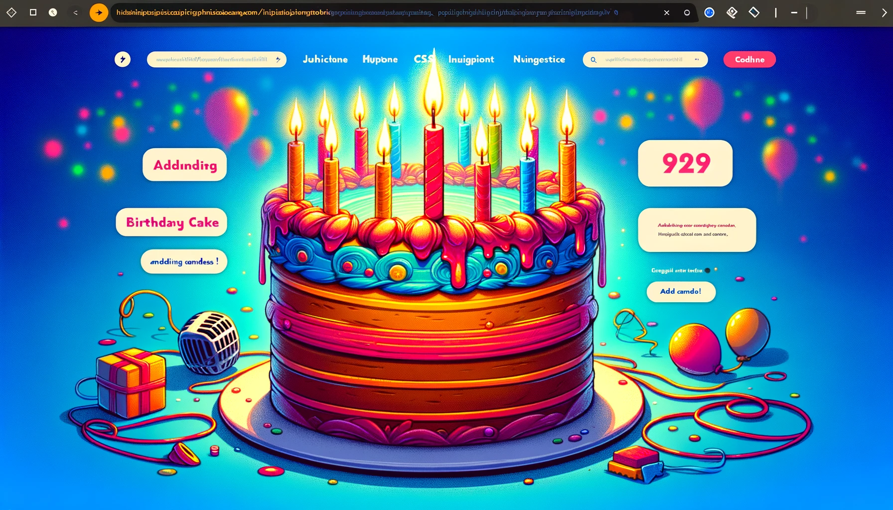

# 🎂 Interactive Birthday Cake Project 🎉

## Overview

This Interactive Birthday Cake 🍰 project is a delightful web-based application hosted on GitHub Pages. Users can interactively add candles 🕯️ to a birthday cake and blow them out using their microphone, combining HTML, CSS, and JavaScript for a charming user experience.

## Motivation

Inspired by a creative Instagram post ([View Post](https://www.instagram.com/reel/C0xoHgDLmqg/)), this project brings the joy of celebrating with a virtual cake to your screen.

## Credits

The cake design was adapted from Fazlur Rahman's creation on CodePen ([View Original Design](https://codepen.io/fazlurr/pen/gPMJMK)).

## Features

- **Interactive Cake**: Click to add candles 🕯️.
- **Microphone Integration**: Blow into your mic to extinguish candles 🎤.
- **Candle Count**: Watch the candle count change dynamically 🔢.
- **Engaging UI**: Engage with a user-friendly interface.

## Accessing the Project

To experience the Interactive Birthday Cake, visit the GitHub Pages link: [Interactive Birthday Cake](https://sherryuser.github.io/cake-blow/)

## How to Use

1. Go to the provided GitHub Pages link.
2. Allow microphone access.
3. Click on the cake to add candles.
4. Blow into your device to blow out the candles.

## Technologies

- HTML
- CSS
- JavaScript

## License

This project is released under the [MIT License](LICENSE). This means it can be used, modified, and distributed freely, as long as it is not used for commercial purposes.
